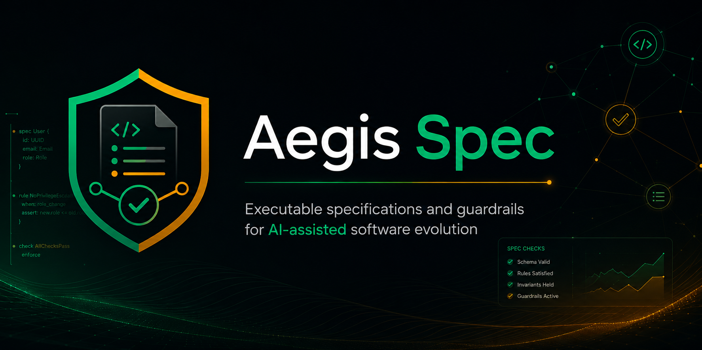
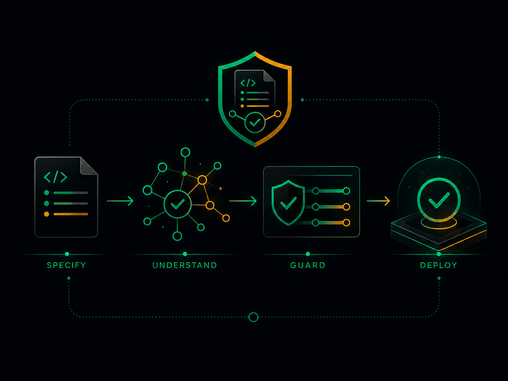
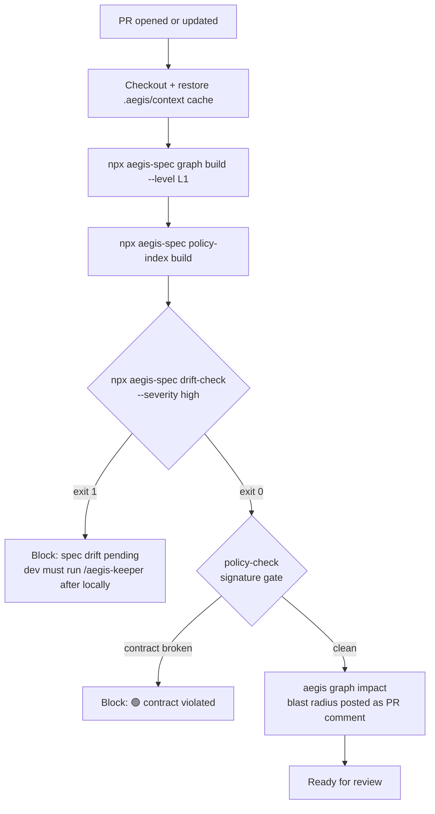

<p align="center">
  
</p>

# Aegis Spec Control Plane
<small>Fork by Wellbrito29, based on Reversa by sandeco</small>

**Turn legacy systems into executable specifications and keep them aligned as AI agents change code.**

[](https://wellbrito29.github.io/Aegis/)<br>
[](https://wellbrito29.github.io/Aegis/pt/)<br>
[](https://wellbrito29.github.io/Aegis/es/)

This project is a fork of [`sandeco/reversa`](https://github.com/sandeco/reversa). It keeps the original Reversa idea — reverse-engineering legacy systems into executable specifications — and extends it into a control plane for day-to-day AI-assisted development.

The upstream project focuses on generating specs from legacy code. This fork adds the missing loop after generation: dependency graph, drift detection, policy gates, Keeper hooks, optional auto-resolution, audit logs, bot scaffolding, and CI templates.

---

## About this fork

- Base: includes upstream `sandeco/reversa` through `upstream/main` commit `144aee2` (`v1.2.28`).
- Fork delta: 24 commits ahead of upstream, released here as `v2.0.0`.
- Package and CLI remain named `aegis` for compatibility: `npx aegis-spec <command>`.
- This is not a passive mirror: the fork changes Aegis Spec from a spec-generation framework into a spec + graph + policy control plane.

### Main differences from upstream

- **Keeper**: new `aegis-keeper` agent keeps specs synchronized with code changes.
- **Graph**: new `lib/graph/` builds `aegis/runtime/context/graph.json` for import impact and L1 symbols/signatures.
- **Policy gates**: new `policy-index` and `policy-check` commands block protected contract breaks.
- **Drift loop**: new `drift-check`, hooks, queue, changelog, and drift dashboard flow.
- **Auto mode**: optional Keeper auto-resolution via `aegis/config/auto-policy.yaml` and `ANTHROPIC_API_KEY`.
- **CI and bot support**: GitHub/GitLab/CircleCI templates plus `bot/keeper-bot/` scaffold.
- **Engine coverage**: adds Kimi CLI support and hook generators for Claude, Cursor, Kimi, Codex, and Opencode.

---

## Why Aegis Spec exists

Most production systems carry years of accumulated knowledge: implicit business rules, undocumented architectural decisions, critical logic buried in code nobody wants to touch. That knowledge exists, but it's trapped.

AI agents are transformative for creating and evolving software, but they depend on specifications to operate safely. For new systems, you write the spec and the agent executes. For legacy systems — or those built with pure vibe coding — there is no spec: the agent has no way of knowing what it cannot break.

**Aegis Spec is the bridge between the legacy system and AI agents.**

It analyzes the existing code, extracts accumulated knowledge (business rules, flows, module contracts, retroactive architectural decisions) and transforms everything into executable, traceable specifications ready for any coding agent.

The result is not documentation for humans to read. These are **operational contracts** that allow an agent to evolve the system with fidelity to what already exists.

---

## Foundation

Aegis Spec is built as a **control plane for AI coding agents**, on three pillars:

| Pillar | Role | Tool |
|---|---|---|
| **Aegis Spec** | Spec authority — features, contracts, invariants, ADRs | `aegis/` + agents (Architect, Writer, Archaeologist…) |
| **Keeper** | Drift gate — keeps specs in sync with code | Hooks + `/aegis-keeper [before\|after]` + `drift-check` |
| **Graph** *(in-house, MIT)* | Codebase oracle — knowledge graph of the actual code | `lib/graph/` + `npx aegis-spec graph` (L0 universal, L1 per-language) |

Together: agents must respect what the code **should be** (Aegis Spec specs), see what it **is** (Graph), and stay aligned (Keeper). Specs are the contract, the graph is the ground truth, drift detection is the gate.

### Pipeline (4 stages)

<p align="center">
  
</p>

```
Stage 1 — Discovery     →  Scout, Archaeologist, Detective, Architect, Writer, Reviewer
                             legacy code → aegis/ specs

Stage 2 — Migration     →  Paradigm Advisor, Curator, Strategist, Designer, Inspector
                             aegis/ → aegis/migration/ plan + parity tests

Stage 3 — Build         →  user's coding agent (Claude / Codex / Cursor / Gemini / Kimi)
                            migration plan → new code

Stage 4 — Control plane →  Keeper + Graph + Policy gate (file-level + signature diff)
                            new code → guarded against drift, signature break, blast-radius edits
```

Stage 2 is optional — use it when migrating to a new stack. Stage 4 is the main difference in this fork (see [ROADMAP.md](ROADMAP.md)).

---

## Installation

In the root of the legacy project:

```bash
npx aegis-spec install
```

The installer will:
1. Detect the AI engines present in the environment (Claude Code, Codex, Cursor, etc.)
2. Ask which agents to install — all selected by default
3. Collect project name, language, and preferences
4. Copy agents to `aegis/skills/`
5. Create the engine entry file (`CLAUDE.md`, `AGENTS.md`, etc.)
6. Create the `aegis/` structure with state, configuration, and plan
7. Generate SHA-256 manifest for safe updates

> Aegis Spec **never deletes or modifies** existing files in your project.
> Agents write only to `aegis/`.

**Requirements:** Node.js 18+

---

> [!IMPORTANT]
> ### 🔒 Guaranteed immutability of the legacy project
>
> The installer only creates new files (`CLAUDE.md`, `AGENTS.md`, `aegis/skills/`, etc.) and **never modifies or deletes any existing file** in your project. During analysis, agents operate under a strict and inviolable directive: **all writes are restricted to `aegis/`** — no other file in your project is touched.

> [!CAUTION]
> ### 💾 Back up your project before starting
>
> Although Aegis Spec never modifies your files, AI agents can make mistakes. **We strongly recommend:**
>
> 1. **Version the project in Git** — make sure all files are committed before starting the analysis
> 2. **Have the repository on GitHub** (or GitLab, Bitbucket) — so you have a safe remote copy
> 3. **Make a local copy of the folder** — a simple `cp -r my-project my-project-backup` protects against any unexpected event
>
> If something unexpected happens during analysis, you can restore the original state with `git restore .` or from the backup copy.

> [!WARNING]
> 🔑 **Aegis Spec does not request, store, or transmit API keys from any LLM service.** All intelligence is delegated to the AI agent already present in your environment (Claude Code, Codex, Cursor, etc.) — no external authentication dependencies.

---

## How to use

After installation, open the project in the AI agent and activate Aegis Spec:

```
/aegis
```

For engines without slash command support (like Codex):

```
aegis
```

Aegis Spec will introduce itself, create a personalized exploration plan, and coordinate the entire analysis. Progress is saved in `aegis/config/state.json` at each checkpoint — if the session is interrupted, just type `aegis` to resume where you left off.

---

## How it works

Aegis Spec uses a 5-phase pipeline orchestrated by the **Aegis Spec** agent:

```
Reconnaissance  Excavation  Interpretation  Generation  Review
    Scout       Archaeologist  Detective      Writer    Reviewer
                                Architect
```

Independent agents (run at any phase): **Visor**, **Data Master**, **Design System**

Continuous loop (after the initial pipeline): **Keeper** keeps specs synchronized as the code evolves — see [Drift loop](#drift-loop) below.

---

## Agents

### Required

| Agent | Role |
|-------|------|
| **Aegis Spec** | Central orchestrator. Coordinates all agents, saves checkpoints, guides the user |
| **Scout** | Maps the surface: folder structure, languages, frameworks, dependencies, entry points |
| **Archaeologist** | Deep module-by-module analysis: algorithms, control flows, data structures |
| **Detective** | Extracts implicit business knowledge: rules, retroactive ADRs, state machines, permissions |
| **Architect** | Synthesizes everything into C4 diagrams, full ERD, integration map, and technical debt |
| **Writer** | Generates specifications as operational contracts with code traceability |

### Optional (installed by default)

| Agent | Role |
|-------|------|
| **Reviewer** | Reviews specs, finds inconsistencies, and validates gaps with the user |
| **Visor** | Documents the interface from screenshots — without needing the system to be running |
| **Data Master** | Complete database analysis: DDL, migrations, ORM, ERD, triggers, procedures |
| **Design System** | Extracts design tokens: colors, typography, spacing, themes, and components |
| **Reconstructor** | Generates a bottom-up rebuild plan from the specs and executes one task at a time |
| **Keeper** | Keeps specs synchronized with code changes — drift detection, changelog, dashboard |

### Translators (input adapters)

Use when the legacy "code" is not source code but a structured artifact like a visual workflow. Generates the SDD spec and prepares the state for the main pipeline to take over.

| Agent | Role |
|-------|------|
| **N8N Translator** | Reads N8N workflows exported as JSON and produces SDD specs ready for Python reimplementation. Activated via `/aegis-n8n` |

---

## What is generated

```
aegis/
├── config/
│   ├── state.json            # Analysis state between sessions
│   ├── config.toml           # Project configuration
│   ├── config.user.toml      # Personal preferences (don't commit)
│   ├── manifest.yaml         # Installation metadata
│   └── files-manifest.json   # SHA-256 hashes for safe updates
├── runtime/
│   ├── context/
│   │   ├── surface.json      # Generated by Scout
│   │   ├── modules.json      # Generated by Archaeologist
│   │   ├── graph.json        # Generated by `aegis graph build`
│   │   └── policy-index.json # Generated by `aegis policy-index build`
│   ├── queue/
│   │   └── keeper-queue.jsonl
│   └── audit/
│       └── YYYY-MM-DD.jsonl  # Decision audit log
├── skills/                   # Installed agent skills
├── specs/
│   ├── sdd/                  # Specs per component
│   │   └── [component].md
│   ├── user-stories/         # User stories (if applicable)
│   ├── adrs/                 # Retroactive architectural decisions
│   └── openapi/              # API specs (if applicable)
├── reports/
│   ├── inventory.md          # Project inventory
│   ├── dependencies.md       # Dependencies with versions
│   ├── code-analysis.md      # Technical analysis per module
│   ├── data-dictionary.md    # Data dictionary
│   ├── domain.md             # Glossary and business rules
│   ├── state-machines.md     # State machines in Mermaid
│   ├── permissions.md        # Permission matrix
│   ├── confidence-report.md  # Confidence report 🟢🟡🔴
│   ├── gaps.md               # Identified gaps
│   ├── questions.md          # Questions for human validation
│   ├── drift.md              # Spec ↔ code drift dashboard (Keeper)
│   └── changelog/            # Code change log (Keeper — by date)
├── architecture/
│   ├── architecture.md       # Architectural overview
│   ├── c4-context.md         # C4 Diagram: Context
│   ├── c4-containers.md      # C4 Diagram: Containers
│   ├── c4-components.md      # C4 Diagram: Components
│   └── erd-complete.md       # Full ERD in Mermaid
├── traceability/
│   ├── spec-impact-matrix.md # Which spec impacts which
│   └── code-spec-matrix.md   # Code file to corresponding spec
└── migration/                # Migration plans (optional)
```

### Confidence scale

Every statement in the specs is marked with:

| Mark | Meaning |
|------|---------|
| 🟢 CONFIRMED | Extracted directly from code — can be cited with file and line |
| 🟡 INFERRED | Deduced from patterns — may be wrong |
| 🔴 GAP | Not determinable from code — requires human validation |

---

## Supported engines

| Engine | File created | Skills path | Activation |
|--------|-------------|-------------|------------|
| Claude Code ⭐ | `CLAUDE.md` | `aegis/skills/aegis-*/` | `/aegis` |
| Codex ⭐ | `AGENTS.md` | `aegis/skills/aegis-*/` | `aegis` |
| Cursor ⭐ | `.cursorrules` | `aegis/skills/aegis-*/` | `/aegis` |
| Gemini CLI | `GEMINI.md` | `aegis/skills/aegis-*/` | `/aegis` |
| Windsurf | `.windsurfrules` | `aegis/skills/aegis-*/` | `/aegis` |
| Antigravity | `AGENTS.md` | `aegis/skills/aegis-*/` | `/aegis` |
| Kiro | (none) | `aegis/skills/aegis-*/` | `/aegis` |
| Opencode | `AGENTS.md` | `aegis/skills/aegis-*/` | `aegis` |
| Cline | `.clinerules` | `aegis/skills/aegis-*/` | `/aegis` |
| Roo Code | `.roorules` | `aegis/skills/aegis-*/` | `/aegis` |
| GitHub Copilot | `.github/copilot-instructions.md` | `aegis/skills/aegis-*/` | `/aegis` |
| Aider | `CONVENTIONS.md` | `aegis/skills/aegis-*/` | `aegis` |
| Amazon Q Developer | `.amazonq/rules/aegis.md` | `aegis/skills/aegis-*/` | `/aegis` |
| Kimi CLI | `AGENTS.md` | `aegis/skills/aegis-*/` | `aegis` |

---

## CLI commands

```bash
npx aegis-spec install                        # Install Aegis Spec in the project
npx aegis-spec status                         # Show current analysis state
npx aegis-spec update                         # Update agents to the latest version
npx aegis-spec add-agent                      # Add an agent to the project
npx aegis-spec add-engine                     # Add support for a new engine
npx aegis-spec add-hooks --engine <id>        # Install Keeper hooks (auto drift loop)
npx aegis-spec remove-hooks --engine <id>     # Remove Keeper hooks
npx aegis-spec drift-check                    # CI gate — exit 1 if drift pending
npx aegis-spec uninstall                      # Remove Aegis Spec from the project
```

The `update` command detects files you modified via SHA-256 and never overwrites customizations.
The `uninstall` command removes only files created by Aegis Spec — nothing from the legacy project is touched.

---

## Drift loop

The Keeper closes the cycle between spec and code so new code does not become legacy.

### Local flow (developer machine)

```
[Edit a file]                 → engine hook → aegis/runtime/queue/keeper-queue.jsonl
                                            → stub in changelog/YYYY-MM-DD.md
                                            → marks spec as 🔴 pending in drift.md

[/aegis-keeper after]       → asks 3 questions (why / breaking / context)
                              → updates impacted specs in-place
                              → reclassifies confidence 🟢🟡🔴
                              → marks specs as 🟢 resolved

[git push]                    → developer commits both code + updated specs
```

### CI flow (control plane enforcement)



| Stage | Where | Tool | On failure |
|---|---|---|---|
| Pre-edit | Local | Keeper `before` + Aegis Spec Graph context | Agent reconsiders |
| Edit | Local | Engine hook | Event queued |
| Post-edit | Local | Keeper `after` | Specs updated, drift cleared |
| CI gate 1 | CI | `drift-check --severity high` | PR fails (drift pending) |
| CI gate 2 | CI | `policy-check --severity high` | PR fails (contract broken) |
| CI report | CI | `aegis graph impact` | Comment on PR (info only) |

> Keeper is **never run automatically in CI** — it asks 3 questions to the developer and updates specs based on that intent. CI only enforces that drift was resolved locally.

### Three layers, each opt-in

1. **Manual** — run `/aegis-keeper after` whenever you want
2. **Automatic** — install hooks: `npx aegis-spec add-hooks --engine <claude-code|cursor|kimi-cli|codex|opencode>`
3. **Enforced** — add `npx aegis-spec drift-check` to CI

See [docs/agentes/keeper.md](docs/agentes/keeper.md), [docs/hooks.md](docs/hooks.md), [docs/drift-check.md](docs/drift-check.md).

---

## Internal structure

```
aegis/
├── config/
│   ├── state.json          # Analysis state between sessions
│   ├── config.toml         # Project configuration
│   ├── config.user.toml    # Personal preferences (don't commit)
│   ├── plan.md             # Exploration plan (user-editable)
│   ├── version             # Installed version
│   ├── manifest.yaml       # Installation metadata
│   └── files-manifest.json # SHA-256 hashes for safe updates
├── runtime/
│   └── context/
│       ├── surface.json       # Generated by Scout
│       ├── modules.json       # Generated by Archaeologist
│       ├── graph.json         # Generated by `aegis graph build`
│       └── policy-index.json  # Generated by `aegis policy-index build`
└── skills/               # Installed agent skills
```

---

## Contributing

Contributions are welcome. Open an issue to discuss before submitting a PR.

```bash
git clone https://github.com/Wellbrito29/Aegis.git
cd aegis-spec
npm install
```

---

## License

MIT — see [LICENSE](LICENSE) for details.
